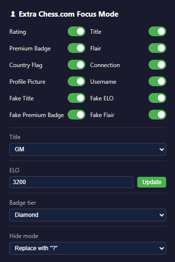
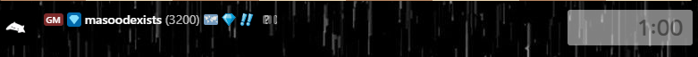
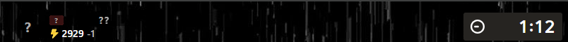
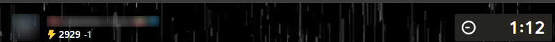

# **Extra Chess.com Focus Mode**

A Chrome extension for chess.com that hides the opponent's rating, title, premium badge, profile picture, country flag, flair, and connection indicator during live games. Each element can be covered with a question mark, blurred at a custom strength, or removed entirely, and every option can be toggled from the toolbar popup.

Settings are stored locally and applied in real time. Hiding is re-applied automatically through a MutationObserver whenever chess.com re-renders the board, and the extension can also fake your own title, ELO, premium badge, and flair.

## Features

- Hide the opponent's rating, chess title, premium badge, profile picture, country flag, flair, and connection indicator in live games
- Three hiding modes per element: replace with a question mark, blur out, or remove completely
- Adjustable blur strength, from a subtle fuzz to a fully unreadable mess
- Toggle every option independently, or leave the defaults and install it and forget it
- Fake title, ELO, premium badge, and flair on your own account, so flexing is one click away
- No account, no telemetry, no backend. Everything runs inside your browser
- Works with the live game layout on chess.com and updates itself as icons and names re-render

## Screenshots

The toolbar popup with all toggles:

Your own profile with a fake GM title, premium badge, and changed ELO:

The opponent hidden with a question mark:

The opponent name and rating blurred out:

## Installation

The extension is not published to the Chrome Web Store, so you load it as an unpacked extension.

1. Download or clone this repository
2. Open Chrome and go to `chrome://extensions`
3. Enable Developer mode in the top right corner
4. Click Load unpacked and select the folder containing this repo
5. The icon appears in your toolbar. Click it to open the popup

## Usage

Open a live game on chess.com and the opponent's info is hidden using your saved settings. Click the extension icon to change what is hidden, how it is hidden, or to turn on the fake options for your own account. Changes apply to any open chess.com tabs immediately, with no page refresh needed.

## License

This project is not licensed. All rights reserved.